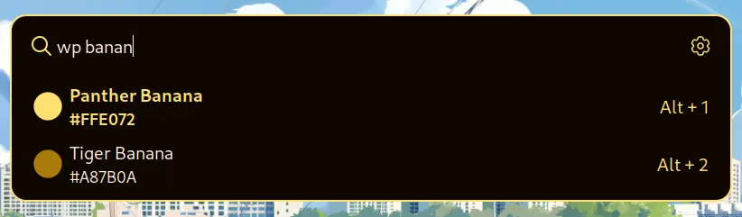
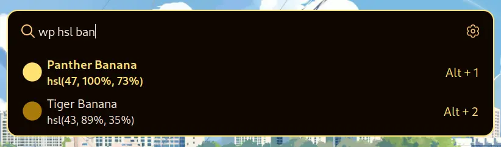

<div align="center">

## Whiskers Palette Extension
</div>

## How to install

Go to `Settings -> Extensions -> Git Clone Extension` and paste the url
```
https://github.com/lighttigerXIV/whiskers-launcher-whiskers-palette-extension
```

## How To Use

To get hex colors type `{color-name}` or `{hex color-name}`



To get rgb colors type `{rgb color-name}`


To get hsl colors type `{hsl color-name}`

